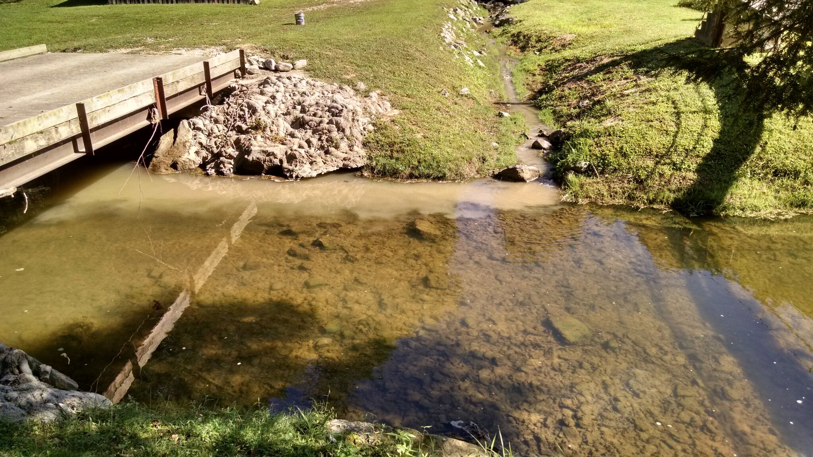

# (PART) Courses {-}

# Introduction (Week 1)

The goal of our first class is twofold. First to pique your interest in the content of the course through open discussion and sharing some videos and images. Second, to get to know each other both in terms of your academic background and your interest in Water Quality. 

## Land-Use change

A core component of this class will be understanding how people change the landscape and how these changes propagate downstream. There are many ways people can impact the land and satellites have been recording these changeas since the 1970s, and with high resolution since 1984, with the launch of Landsat 5.

- What kind of land-use change can you see in the video below? 

- What human impacts are not captured by this video or by satellite observation in general? 

- Which land-use changes are most likely to impact inland waters? 

<iframe width="800" height="500" src="https://www.youtube.com/embed/kIYHGkSb-fU" frameborder="0" allow="accelerometer; autoplay; encrypted-media; gyroscope; picture-in-picture" allowfullscreen></iframe>

If you enjoy looking at these timelapses, I encourage you to play around with this [website from Google and Carnegie Melon](https://earthengine.google.com/timelapse/) which shows the entire globe changing over the past 30 years.

## Types of Water Quality Change

The ways people can alter water quality are almost limitless as we continue to invent [new chemicals](https://esajournals.onlinelibrary.wiley.com/doi/abs/10.1002/fee.1450), [create novel cocktails of elements](https://royalsocietypublishing.org/doi/full/10.1098/rstb.2018.0017), and a myriad other impacts. Understanding which of these impacts are most harmful to people and the environment will be part of this course, but we will also cover which problems are avoidable, which are inherent to modern life, and which ones can be treated. 

- What water quality problem do you think is most pressing right now in Colorado? in the United States? the Globe? 

- What causes the water quality problem you identifed from above? Was it land-use change or something else? 

## My work on land-use change - Mining in West Virginia

For my PhD I worked on understanding the impacts of a particularly destructive form of coal mining called Mounataintop Mining. Mountaintop mining covers almost 6,000 square kilometers of land in Central Appalachia. This map shows the expansion of Mountaintop Mining in West Virginia and Kentucky. You can see more [here](http://skytruthmtr.appspot.com/)

Unlike most land-use change impacts, mounataintop mining does not only change the land in two-dimensions, but direclty alters the topography of the landscape as shown here. 

<video width="720" height="440" controls>
  <source src="images/mr7.mp4" type="video/mp4">
</video>

Whether agricutlure, mining, or industry, almost all human activities on land end up impacting water quality downstream. 

## Types of Water Quality Change

- What water quality problem do you think is most pressing right now in Colorado? in the United States? the Globe? 

- What causes the water quality problem you identifed from above? Was it land-use change or something else? 

## Examples of water quality impacts 

For each image answer the following questions

- what is the water quality impact you see? 
- What may have caused this impact? 
- Is it natural or human-caused? 

### Lake Erie

Lake Erie algae bloom caused by excess nutrients from agriculture and increasing temperatures from climate change

### Animas

Animas river had ~ 3 million gallons of mine waste accidentally released into it from the abandoned Gold King Mine. The spill contained a variety of elemental contaminants including: arsenic, cadmium, lead, aluminum, and copper, with the orange color coming from iron. The long-term impacts from the spill are still unknown

### West Virginia

This is a case where the murky brown water you see in this flood are completely natural. This was a major flooding event in a reference watershed for some of our work on the impacts of mining (more [here](https://pubs.acs.org/doi/abs/10.1021/acs.est.7b02288)). This was just a very large flood that mobilized a lot of sediment in the river. I'm standing on a bridge that is about 4 feet above the river bottom. 

### West Virginia 2

In this image we have Laurel Branch flowing into the Mud River. Although the Mud River water looks clear here, both streams are heavily impacted by mining and have high ion concentrations in the water leading to elevated salinity and declines in biodiversity. Not all pollutants are visible. 

### Fort Collins

<iframe title="COLORADOAN- Embed Player" width="540" height="350" frameborder="0" scrolling="no" allowfullscreen="true" marginheight="0" marginwidth="0" src="https://uw-media.coloradoan.com/embed/video/1385455002?placement=snow-embed"></iframe>

Video documenting a fish kill that happened in Fort Collins in October of 2018. The cause of the fish kill is still unkown, but something the city is still investigating. These kinds of events often cause lots of public attention but understanding exactly why fish-kills occur can be difficult. 

### Boulder 

Starting in 2004, David Norris noticed that the fish in Boulder Creek were changing sex. Eventually he discovered that this was due to a suite of chemicals that imitate estrogen being released into the river. Modern organic contaminants are one of the least well-understood impacts to water quality. 

## Treatment

- As we will learn in this class most water quality problems are pernicious and wicked
- Difficult to treat once they start and hard to disentangle from the land-use
change that causes them

## Summary

- The goal of this course is for you to intuitively and quantitatively understand the linkages between human's actions on land and our downstream water quality impacts. 
- Before Friday's class please complete Canvas Quiz on your background and previous
experience with related topics (remote sensing, water quality, etc...)
