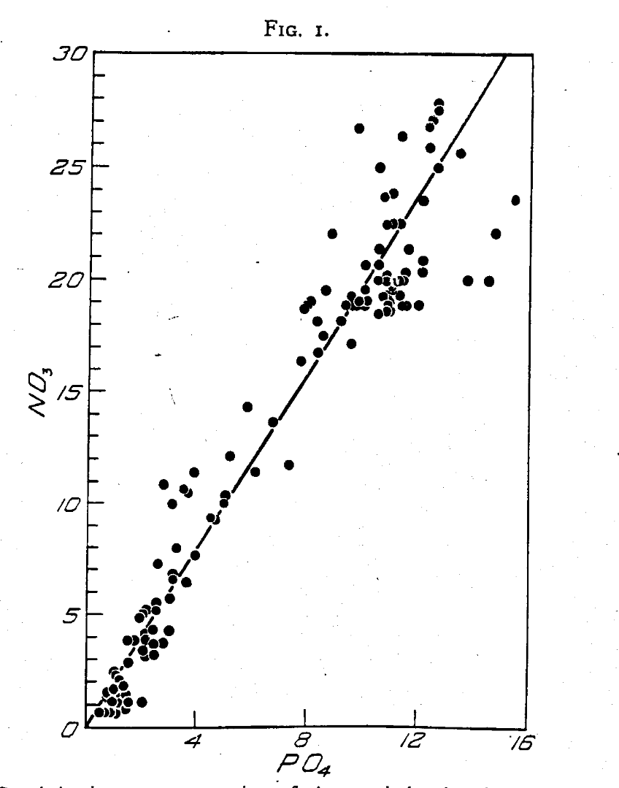

## Housekeeping

- Questions from Friday? 

## What is a nutrient?

- Wiki definition: "A nutrient is a substance used by an organism to survive, grow, and reproduce"
- In groups of 3 or 4 try to identify as many nutrients you know of as possible. 
  - If you can, note what this nutrient does to help sustain life
  
## What is a nutrient cycle? {.build}

## What is a nutrient cycle? 

<iframe width="560" height="315" src="https://www.youtube.com/embed/_IBx0zpNoEM" frameborder="0" allow="accelerometer; autoplay; encrypted-media; gyroscope; picture-in-picture" allowfullscreen></iframe>

## Is this a nutrient cycle? 

## Is this a nutrient cycle?

from [(Hunter and Boyd 2007)](http://citeseerx.ist.psu.edu/viewdoc/download?doi=10.1.1.561.4291&rep=rep1&type=pdf)

## How do nutrient cycles interact? {.build}

## How do nutrient cycles interact?

## How do nutrient cycles interact? {.build}

- Relative ratio of elements required for life [Redfield 1934](http://cmore.soest.hawaii.edu/summercourse/2012/documents/bronk_05-30-12/Redfield_1934.pdf)

## How do nutrient cycles interact? {.build}

## Chemical reactions that govern nutrient and biogeochemical cycles

- Electron exchange (Redox reactions)

- Proton exchange (Acid/Base reactions)

- Assimilation (incorporating nutrient into cellular structures)

- Osmotic regulation

- Capturing photons to split water (photosynthesis requires Mn)

- Technology

## Redox

