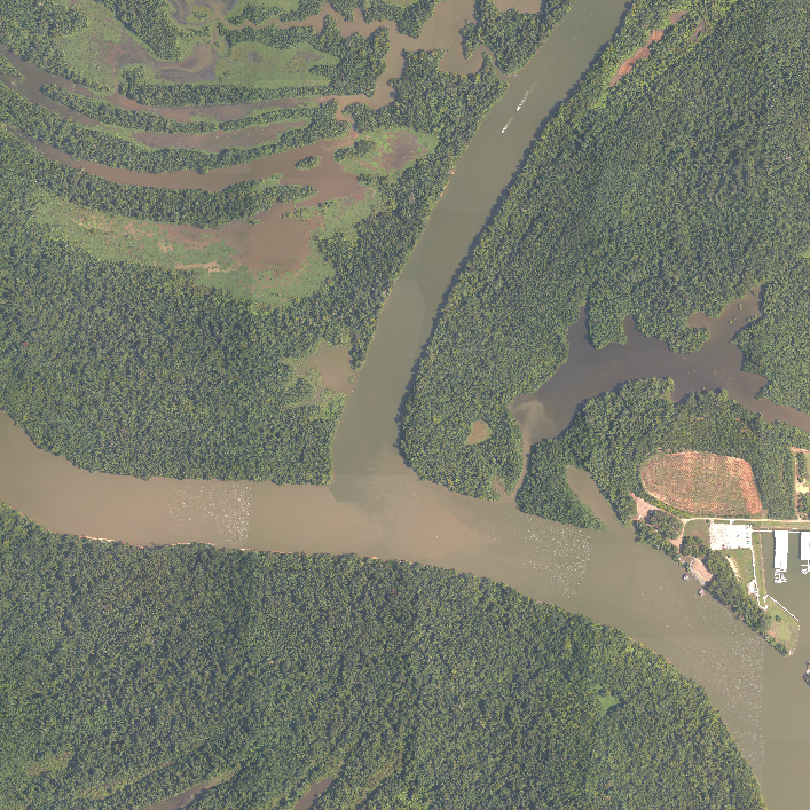

<style>
slides > slide {
  overflow-x: auto !important;
  overflow-y: auto !important;
}
</style>


## Housekeeping

- Readings for Wednesday will be up on Canvas after class

- Questions from Friday? 

```{r setup,include=F}
library(tidyverse)
library(ggthemes)
knitr::opts_knit$set(root.dir='..')
knitr::opts_chunk$set(echo = FALSE,warning=F,cache=F)

```


## Remote sensing (a little deeper)




## 


<video width="500"  controls loop>
  <source src="rs_images/wavelengths.mp4" type="video/mp4">
Your browser does not support the video tag.
</video> 

## 

<video width="500"  controls loop>
  <source src="rs_images/wavelengthsrel.mp4" type="video/mp4">
Your browser does not support the video tag.
</video> 

## Using remote sensing 

- http://climateengine.org/

- Deep time-series of remotely sensed data

- Pick a place you know has undergone land-use or wq change 

- Pick a place you aren't sure about and do the same


## Mid-term


```{r,echo=F}

exams <- read_csv('exams/exam_grades/spring2019/WR418_Midterm.csv') %>%
  filter(!is.na(midterm)) %>%
  mutate(raw_grade_percent = 100*midterm/40) %>%
  mutate(curve_grade_percent = 100*midterm/36)

ggplot(exams,aes(x=raw_grade_percent)) +
  geom_histogram(bins=9,col='black',fill='white') +
  theme_few() +
  ggtitle('Raw exam scores') + 
  xlab('Grade (%)')

```


## Raw summary data


```{r}
summary(exams$raw_grade_percent)
```


## Pourbaix and Gibbs

- Most folks didn't do so hot (so my fault)

- Remove Pourbaix score (3 pts) and 1 pt for gibbs so total is now out of 
36 points instead of 40

```{r}
long_exams <- exams %>%
  select(-midterm) %>%
  gather(.,key=key,value=value,-Student)


ggplot(long_exams,aes(x=value,fill=key)) +
  geom_density(alpha=.4,show.legend=F) +
  theme_few() +
  ggtitle('Exam scores') + 
  xlab('Grade (%)') + 
  scale_fill_manual(values=c('red','gray'))
  


```


## Final averages etc...

```{r}

summary(exams$curve_grade_percent)

```

## Exam scores will be uploaded today

- And given to you on Wed


```{r}

```


