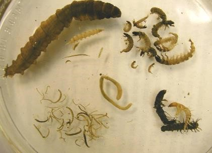

## Housekeeping

- Questions from last week? 

- Final presentations will start Monday May 6 and end Friday May 10

## Final Rubric (will be posted after class)

- Scientific content and mastery of material (10 pts)

- Connecting material to ideas covered in class (10 pts)

- Equal participation in group, as ranked by peers (10 pts)

- Style, saliency, and concision (10 pts)

- Novel ideas (5 pts) 

- Participation in final presentations (5 pts)

- *Total 50 pts*

## Scientific content and mastery of material

- How does your contaminant get into the environment?

- What impacts does your contaminant have on aquatic life? on human health? 

- What are the major unknowns for your contaminant? 

- What processes are used to remove this contaminant from
our waterways? 

- All of these answers should be supported with primary literature citations in APA format (for written component I )

## Connecting material to ideas covered in class (10 pts)

- Your paper/presentations should explicitly include ideas we have covered in class

- These can include acid/base chemistry, redox, sorption, treatment, sensors, remote sensing, clean water act, etc...

- This should be seamlessly integrated throughout presentation/paper, and not just random call-outs

## Equal participation in group, as ranked by peers (10 pts)

- Group members will rank participation of other members
on a scale of 1-10. 

## Style, saliency, and concision (10 pts)

- Presentation/papers should be fun to read/watch while also delivering plenty of scientific content

- Use figures/images to explain complex ideas

- Clearly organize your papers and link ideas throughout

- Don't be verbose, concise sentences and summaries are much more effective than arbitrarily long paragraphs

- Make sure to cover why someone should care about your work (saliency), this should be discussed at the beginning and end of your presentation. 

## Novel ideas (5 pts)

- While this class covers lots of components that impact water quality we can't cover them all.

- Your presentations should include novel ideas like: photobleaching, ecotoxicology, and other ideas barely covered in class

## Participation in final presentations (5 pts)

- Come support your fellow presenters and ask questions after their talks. 

## Questions about final?

- For presenting groups sign-up sheet for dates is online

## Macroinvertebrates 

## An analogy

<iframe width="560" height="315" src="https://www.youtube.com/embed/K5CZ74ybnbE" frameborder="0" allow="accelerometer; autoplay; encrypted-media; gyroscope; picture-in-picture" allowfullscreen></iframe>

## Freshwaters can be equally diverse

<iframe width="560" height="315" src="https://www.youtube.com/embed/_3WPquhB7RE" frameborder="0" allow="accelerometer; autoplay; encrypted-media; gyroscope; picture-in-picture" allowfullscreen></iframe>

## Cumulative impacts

## Cumulative impacts

## EPT

- Ephemeroptera (Mayflies)

- Plecoptera (Stoneflies)

- Tricoptera (Caddisflies)

http://macroinvertebrates.org/

## Macroinvertebrate assessments

## More on macros on Friday

